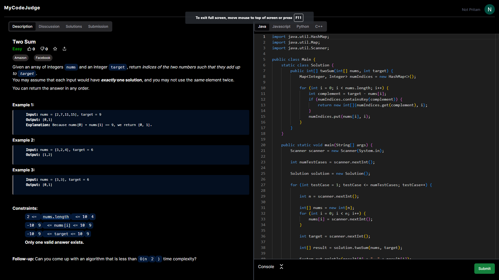
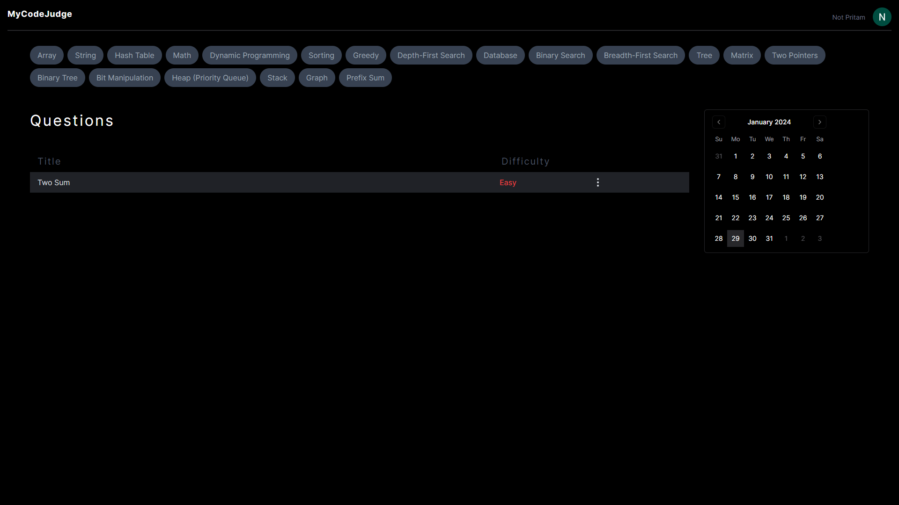

# MyCodeJudge

MyCodeJudge is a LeetCode clone with an integrated code judge system, designed to provide a seamless coding experience. With features such as authentication, session management, and a beautiful UI for code editing, MyCodeJudge aims to streamline the coding practice and evaluation process. The platform supports multiple programming languages, including Java, JavaScript, C++, and Python. The system ensures server safety by utilizing Docker to compile and run code in a separate environment.

## Features

1. **Authentication and Session Management**
   - Users are required to log in to submit code for evaluation.
   - Session management ensures a secure and personalized coding experience.

2. **Multi-language Support**
   - Users can choose from a variety of programming languages, including Java, JavaScript, C++, and Python.

3. **Beautiful Code Editor UI**
   - A sleek and intuitive code editor interface provides an enhanced coding experience.

4. **Admin Panel**
   - Admins have the ability to add and remove coding questions, maintaining a dynamic and evolving set of challenges.

5. **Server Safety with Docker**
   - Docker is employed to compile and run code in a separate environment, ensuring the security of the server.

6. **Question Filtering**
   - Users can filter coding questions based on difficulty level, topic, and company tags, making it easy to find relevant challenges.

## Tech Stack

- **Frontend:**
  - Next.js
  - Shadcn UI
  - Tailwind CSS
  - Axios
  - Zustand

- **Backend:**
  - Node.js with Express

- **Database:**
  - MongoDB

- **Authentication:**
  - OAuth with Google login

- **Code Compilation:**
  - Docker

## Screenshots

*Include some screenshots of the user interface showcasing the code editor, question filters, and any other relevant features.*


*Caption: Beautiful and user-friendly code editor.*


*Caption: Efficient question filtering based on level, topic, and company tags.*

## Getting Started

1. **Clone the repository:**
   ```bash
   git clone https://github.com/notpritam/MyCodeJudge.git
   ```

2. **Install dependencies:**
   ```bash
   cd MyCodeJudge
   cd frontend
   npm install
   cd ../backend
   npm install
   ```

3. **Set up the database:**
   - Configure MongoDB and provide the connection string.

4. **Configure OAuth:**
   - Set up OAuth with Google login and update the configuration.

5. **Run the application:**
   ```bash
   npm start
   ```

Visit [http://localhost:3000](http://localhost:3000) to access MyCodeJudge locally.
Visit [http://localhost:3001](http://localhost:3000) to access MyCodeJudge Backend locally.